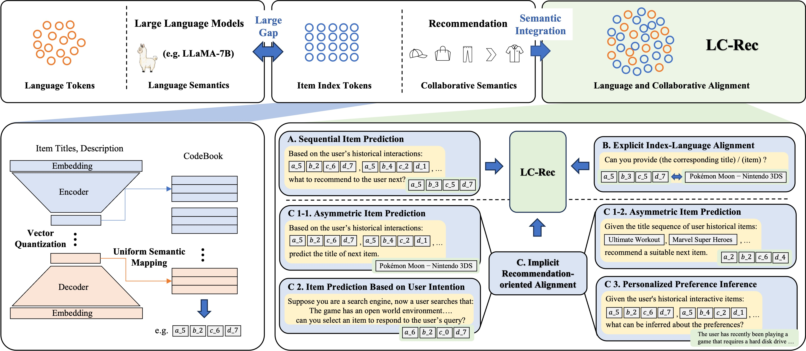

# LC-Rec

This is the official PyTorch implementation for the paper:

> [Adapting Large Language Models by Integrating Collaborative Semantics for Recommendation](https://arxiv.org/abs/2311.09049)

## Overview

We propose **LC-Rec**, a new approach to integrate **L**anguage and **C**ollaborative semantics for improving LLMs in **Rec**ommender systems. To tackle the large gap between the language semantics modeled by LLMs and collaborative semantics implied by recommender systems, we make two major contributions in two aspects. For item indexing, we design a learning-based vector quantization method with uniform semantic mapping, which can assign meaningful and non-conflicting IDs (called item indices) for items. For alignment tuning, we propose a series of specially designed tuning tasks to enhance the integration of collaborative semantics in LLMs. Our fine-tuning tasks enforce LLMs to deeply integrate language and collaborative semantics (characterized by the learned item indices), so as to achieve an effective adaptation to recommender systems.



## Requirements

```
torch==1.13.1+cu117
accelerate
bitsandbytes
deepspeed
evaluate
peft
sentencepiece
tqdm
transformers
```

## Model Checkpoint

The delta weights on the three datasets can be downloaded from huggingface hub ([Instruments](https://huggingface.co/bwzheng0324/lc-rec-instruments-delta), [Arts](https://huggingface.co/bwzheng0324/lc-rec-arts-delta), [Games](https://huggingface.co/bwzheng0324/lc-rec-games-delta)). After downloading, you can add our deltas to the original LLaMA weights to obtain LC-Rec weights:

1. Get the original [LLaMA](https://huggingface.co/huggyllama/llama-7b) weights.
2. Use the following scripts to get LC-Rec weights by applying our delta.

```shell
python -m convert/merge_delta.py \
    --base-model-path /path/to/llama-7b \
    --target-model-path /path/output/lc-rec \
    --delta-path bwzheng0324/lc-rec-games-delta
```

## Dataset

We use three datasets in our paper, all of which have been uploaded to [Google Drive](https://drive.google.com/drive/folders/1RcJ2M1l5zWPHYuGd9l5Gibcs5w5aI3y6?usp=sharing) 

## Train

The detailed scripts for all three datasets are in `run.sh`:

```shell
DATASET=Games
BASE_MODEL=huggyllama/llama-7b
DATA_PATH=./data
OUTPUT_DIR=./ckpt/$DATASET/

torchrun --nproc_per_node=8 --master_port=3324 finetune.py \
    --base_model
    --output_dir $OUTPUT_DIR \
    --dataset $DATASET \
    --data_path $DATA_PATH \
    --per_device_batch_size 8 \
    --gradient_accumulation_steps 2 \
    --learning_rate 5e-5 \
    --epochs 4 \
    --weight_decay 0.01 \
    --save_and_eval_strategy epoch \
    --deepspeed ./config/ds_z3_bf16.json \
    --bf16 \
    --only_train_response \
    --tasks seqrec,item2index,index2item,fusionseqrec,itemsearch,preferenceobtain \
    --train_prompt_sample_num 1,1,1,1,1,1 \
    --train_data_sample_num 0,0,0,100000,0,0 \
    --index_file .index.json


cd convert
nohup ./convert.sh $OUTPUT_DIR >convert.log 2>&1 &
cd ..
```

## Test

Test with a single GPU:

```shell
DATASET=Games
DATA_PATH=./data
OUTPUT_DIR=./ckpt/$DATASET/
RESULTS_FILE=./results/$DATASET/result.json

python test.py \
    --gpu_id 0 \
    --ckpt_path $CKPT_PATH \
    --dataset $DATASET \
    --data_path $DATA_PATH \
    --results_file $RESULTS_FILE \
    --test_batch_size 1 \
    --num_beams 20 \
    --test_prompt_ids all \
    --index_file .index.json
```

Test with multiple GPUs:

```shell
DATASET=Games
DATA_PATH=./data
OUTPUT_DIR=./ckpt/$DATASET/
RESULTS_FILE=./results/$DATASET/result.json

torchrun --nproc_per_node=8 --master_port=4324 test_ddp.py \
    --ckpt_path $CKPT_PATH \
    --dataset $DATASET \
    --data_path $DATA_PATH \
    --results_file $RESULTS_FILE \
    --test_batch_size 1 \
    --num_beams 20 \
    --test_prompt_ids all \
    --index_file .index.json
```

## Acknowledgement

The implementation is based on [HuggingFace](https://github.com/huggingface/transformers).

